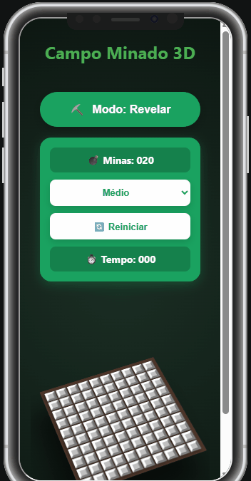

# 💣 Campo Minado 3D (Minesweeper 3D)

Uma releitura moderna, tridimensional e totalmente responsiva do clássico jogo de lógica **Campo Minado**. Desenvolvido utilizando tecnologias web nativas, o projeto traz uma experiência imersiva com efeitos de perspectiva e rotação dinâmica em eixos tridimensionais, adaptando-se perfeitamente desde monitores desktop até telas de smartphones.
## Demonstração PC

## Demonstração Mobile
<p align="center">
  
</p>

## 🚀 Funcionalidades

- **Perspectiva Tridimensional Nativa**: Tabuleiro renderizado sob uma matriz 3D dinâmica utilizando propriedades avançadas de CSS como `transform-style: preserve-3d` e `perspective`.
- **Efeito de Inclinação Dinâmica**: O tabuleiro reage sutilmente à interação do mouse em ambientes desktop, aumentando a percepção de profundidade.
- **Design Totalmente Responsivo**: Layout fluído construído com CSS Grid e variáveis customizadas que se reajustam dinamicamente por meio de Container Queries (`cqw`).
- **Controle Otimizado para Mobile**: Interface móvel inteligente que oculta instruções extensas de teclado e introduz um alternador intuitivo de ações por toque (Modo Revelar ⛏️ / Modo Bandeira 🚩).
- **Componentização Avançada**: Código modularizado utilizando **Web Components** nativos e isolamento total de escopo visual com **Shadow DOM**.
- **HUD Integrado**: Cronômetro de partida progressivo e contador em tempo real de minas restantes com preenchimento de dígitos (`padStart`).

## 🛠️ Tecnologias Utilizadas

- **HTML5**: Estrutura semântica e tags customizadas (`<layout-campo>`, `<campo-quadrado>`).
- **CSS3 Avançado**: 
  - Estruturas de layout modernas via CSS Grid e Flexbox.
  - Funções de dimensionamento fluidas (`clamp()`, unidades de viewport `vw` / `vmin`).
  - Container Queries (`container-type` e `cqw`) para o redimensionamento matemático dos blocos internos.
  - Efeitos tridimensionais puros baseados em matrizes de rotação e profundidade no eixo Z (`translateZ`).
- **JavaScript (Vanilla ECMAScript Moderno)**:
  - Criação de Custom Elements estendendo `HTMLElement`.
  - Manipulação de estados reativos usando getters estáticos (`observedAttributes`) e ganchos de ciclo de vida (`attributeChangedCallback`).
  - Comunicação assíncrona desacoplada por meio de disparos de eventos personalizados (`CustomEvent` com `bubbles` e `composed`).

## 📁 Estrutura do Projeto

```text
src/
├── assets/
│   ├── icons/            # Ícones gerais do projeto
│   ├── Animacao.gif      # Elemento de animação visual/demonstração
│   └── AnimacaoMobile.gif       # Elemento de animação visual/demonstração Mobile
├── components/
│   ├── Quadrado.js       # Web Component do bloco individual (Shadow DOM)
│   └── Tabela.js         # Web Component do grid e do HUD do tabuleiro
├── logic/
│   └── Jogo.js           # Regras, posicionamento de minas e mecânica do jogo
├── styles/
│   └── style.css         # Estilização global do jogo e regras de Media Queries
├── main.js               # Script principal (ponto de entrada e orquestração)
└── index.html            # Estrutura principal da página e contêineres globais
```


## 🎮 Como Jogar

### No Desktop (Mouse e Teclado)
- **Clique Esquerdo**: Revela o quadrado selecionado. Se houver uma bomba, fim de jogo!
- **Clique Direito**: Adiciona ou remove uma bandeira de sinalização 🚩 sobre locais suspeitos de conter minas.
- **Hover**: Mova o mouse sobre a área tridimensional para inclinar levemente a perspectiva do tabuleiro.

### No Mobile (Telas de Toque)
1. Utilize o menu superior **Modo: Revelar ⛏️ / Modo: Bandeira 🚩** para alternar a ação do seu clique.
2. Toque diretamente sobre os blocos tridimensionais do campo para executar a ação selecionada no botão.

---

## ⚙️ Detalhes de Implementação Destacados

### Arquitetura Dinâmica do Bloco (Shadow DOM)
Para evitar travamentos de pixels comuns em layouts antigos, o tamanho dos blocos internos calcula sua proporção diretamente a partir do espaço gerado pelo elemento pai. A fonte se auto-ajusta usando lógica de Container Query:

```javascript
/* Trecho interno encapsulado no Web Component Quadrado */
div {
  width: 100%;
  height: 100%;
  aspect-ratio: 1 / 1;
  font-size: 4.5cqw; /* Fonte cresce proporcionalmente ao tamanho do bloco */
}
```

### Isolamento Tridimensional no Mobile
A quebra de layout de telas verticais foi corrigida isolando as projeções diagonais tridimensionais por meio de um reset estrito de coordenadas e controle de transbordo:

```css
@media (max-width: 768px) {
  #cena-3d {
    display: flex;
    justify-content: center;
    overflow: hidden; /* Corta transbordos fantasmas da projeção 3D */
  }
  layout-campo {
    position: relative !important;
    top: auto !important;
    left: auto !important;
    transform: rotateX(42deg) rotateZ(-22deg) scale(1) !important;
  }
}
```

---
